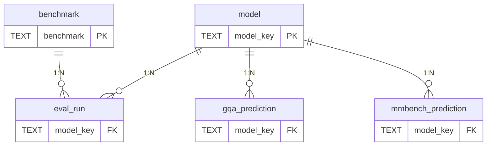

# solution/db — база результатов оценки (SQLite)

Реляционное хранилище результатов оценки моделей. Нормализованная схема (3НФ), наполняется
из сырых артефактов прогонов и используется для аналитических запросов (сравнение моделей,
разрез по навыкам, разбор ошибок).

## Состав

| Файл | Назначение |
|---|---|
| `schema.sql` | DDL: таблицы, ключи, внешние ключи, индексы, представления (VIEW) |
| `build_db.py` | загрузчик: `results/raw/*.{meta.json,jsonl}` → `vk_vlm.sqlite` (stdlib, без GPU) |
| `queries.sql` | примеры аналитических запросов (JOIN, GROUP BY, агрегаты, self-join) |
| `admin.py` | администрирование: `stats`, `check`, `backup`, `optimize`, `plan` |
| `api.py` | REST API + веб-дашборд над БД (stdlib `http.server`, без зависимостей) |
| `vk_vlm.sqlite` | сама база (создаётся `build_db.py`) |

## Схема

```
model(model_key PK, label, is_ours)
benchmark(benchmark PK, title, n_total)
eval_run(model_key FK→model, benchmark FK→benchmark, n, accuracy,
         accuracy_extracted, accuracy_lenient, letter_rate, seconds,  PK(model_key,benchmark))
gqa_prediction(model_key FK→model, question_id, image_id, question, gold, pred,
               correct, correct_extracted,  PK(model_key,question_id))
mmbench_prediction(model_key FK→model, idx, category, question, gold, pred_letter,
                   correct,  PK(model_key,idx))
```

- `model` и `benchmark` — справочники; `eval_run` — факт-таблица метрик (звезда).
- `gqa_prediction.image_id` — ключ сшивки вопроса с изображением COCO.
- `mmbench_prediction.category` — навык (20 категорий), индексирован для разреза по навыкам.

### ER-диаграмма



### Нормализация

3НФ: повторяющиеся атрибуты моделей и бенчмарков вынесены в справочники (`model`,
`benchmark`), факт-таблица `eval_run` и таблицы предсказаний ссылаются на них по внешним
ключам — нет дублирования меток/описаний, нет транзитивных зависимостей. Представления
(`v_leaderboard`, `v_skill_accuracy`) инкапсулируют частые отчётные выборки.

### Представления (VIEW)

- `v_leaderboard` — метрики всех моделей в одной строке (GQA extracted/exact + MMBench).
- `v_skill_accuracy` — точность по навыкам MMBench (`model_key`, `category`, `n`, `accuracy`).

## Администрирование

```bash
python solution/db/admin.py stats      # таблицы/строки, индексы, представления, размер
python solution/db/admin.py check       # integrity_check + foreign_key_check
python solution/db/admin.py backup       # онлайн-резервная копия (SQLite .backup)
python solution/db/admin.py optimize     # ANALYZE + VACUUM
python solution/db/admin.py plan         # EXPLAIN QUERY PLAN отчётного запроса
```

## Приложение — REST API + дашборд

```bash
python solution/db/api.py                # http://127.0.0.1:8000
```

Эндпоинты (JSON): `/api/leaderboard`, `/api/models`, `/api/skills?model=…`,
`/api/errors?model=…&limit=N`; корень `/` — HTML-дашборд. Запросы параметризованы,
имя модели валидируется по справочнику (защита от SQL-инъекций).

## Запуск

```bash
python solution/db/build_db.py                              # собрать базу
sqlite3 solution/db/vk_vlm.sqlite < solution/db/queries.sql # выполнить запросы
# или из Python: sqlite3.connect("solution/db/vk_vlm.sqlite")
```

Объём загрузки: 4 модели, 2 бенчмарка, 8 прогонов, 4000 предсказаний GQA, 15640 — MMBench.

## Примеры запросов

- **Лидерборд** — `JOIN eval_run × model`, пивот по бенчмарку.
- **Точность по навыкам** — `GROUP BY category` для MMBench.
- **Эффект метрики `extracted`** — число ответов с `correct=0 AND correct_extracted=1`.
- **Разбор ошибок** — выборка `WHERE correct_extracted=0`.
- **Разрыв с эталоном по навыкам** — self-join `mine-8b` × `ref-saiga-8b` по `idx`.

Полные тексты — в `queries.sql`.
